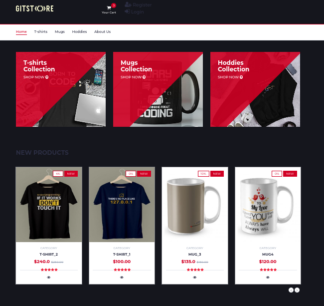

<a name="readme-top"></a>


[![Contributors][contributors-shield]][contributors-url]

<!-- 

<h1 align="center">GitStore</h1> -->


<p align="center">
  
</p>
<h1 align="center">GitStore | <a href="http://mahmoudelwazeer.tech">Demo</a></h1>





# Introduction
GitStore is an e-commerce website that focused on selling t-shirts, mugs and hoddies for computer science engineers

### Built With
* [![Python][Python]][python-url]
* [![flask][flask]][flask-url]
* [![javaScript][javaScript]][javaScript-url]
* [![Bootstrap][Bootstrap.com]][Bootstrap-url]

### Online Demo
Check out the online demo for Matomo at http://mahmoudelwazeer.tech or 
http://karimmoharm.tech

<p align="right">(<a href="#readme-top">back to top</a>)</p>


# Installation

## Setting Up Virtual Environment
1. first clone the repo using git clone
```bash
git clone https://github.com/Mahmoud-Elwazeer/GitStore.git
```

2. Navigate to the project directory:
```bash
cd GitStore
```
3. make sure you have Python 3 then create a  virtual environment
```bash
python3 -m venv venv
```

4. Activate the virtual environment
- on Linux/macOS:
    ```bash
    source venv/bin/activate
    ```
- on windows
    ```cmd
    .\venv\Scripts\activate
    ```

5. install dependencies
```
pip install -r requirments.txt
```
## Database Configuration
1. Create a MySQL database for the Git Store website.

## Running the Application
After installing all requirments open the terminal or cmd and type
```
python3 run.py
```

2. Open your web browser and navigate to http://localhost:5000.

That's it! You should now have the Git Store website up and running locally.

<p align="right">(<a href="#readme-top">back to top</a>)</p>


# Usage

## Accessing the Web Application

1. Open your web browser.

2. Navigate to the deployed Git Store website

3. If you are a new user, click on the "Register" link to create an account.

4. Fill in the required information such as username, email, and password.


### Browsing Products

1. Explore the different product categories, such as T-shirts, Mugs, and Hoodies, available on the homepage.

2. Click on a product to view detailed information.

### Making a Purchase

1. Add desired products to your cart by clicking the "Add to Cart" button on the product page.

2. Navigate to the "Checkout" page to review your selected items.

3. Enter your shipping information.

4. Complete the purchase by providing payment details.

<p align="right">(<a href="#readme-top">back to top</a>)</p>


# Contributing

Got something interesting you'd like to share?

We welcome contributions from the community to improve Git Store. If you're interested in contributing, please follow these guidelines:

1. Fork the Git Store repository.

2. Clone your forked repository to your local machine:

```bash
git clone https://github.com/Mahmoud-Elwazeer/GitStore.git
```

3. go the installation section and install the requirments  

4. create new branch for your new feature or fix bugs
```bash
git branch -b your-branch-name
```

5. commit the changes and push them to github and make a pull request and we will review the changes before mergin it 

<p align="right">(<a href="#readme-top">back to top</a>)</p>


# Related projects

Explore these related projects that complement Git Store:

1. **[merchshop](https://merchshop.in/product-category/geek-programmers-coding-developer-tshirts-india/):**

<p align="right">(<a href="#readme-top">back to top</a>)</p>


# Licensing


<!-- URL -->
[contributors-shield]: https://img.shields.io/github/contributors/othneildrew/Best-README-Template.svg?style=for-the-badge

[contributors-url]: https://github.com/Mahmoud-Elwazeer/GitStore/graphs/contributors
[python-url]: https://www.python.org/
[flask-url]: https://flask.palletsprojects.com/en/3.0.x/
[Bootstrap.com]: https://img.shields.io/badge/Bootstrap-563D7C?style=for-the-badge&logo=bootstrap&logoColor=white
[Bootstrap-url]: https://getbootstrap.com
[javaScript-url]: https://getbootstrap.com

[python]: https://img.shields.io/badge/python-0769AD?style=for-the-badge&logo=python&logoColor=yellow&white
[flask]: https://img.shields.io/badge/flask-000000?style=for-the-badge&logo=flask&logoColor=white

[javaScript]: https://img.shields.io/badge/javaScript-20232A?style=for-the-badge&logo=javaScript&logoColor=yellow


